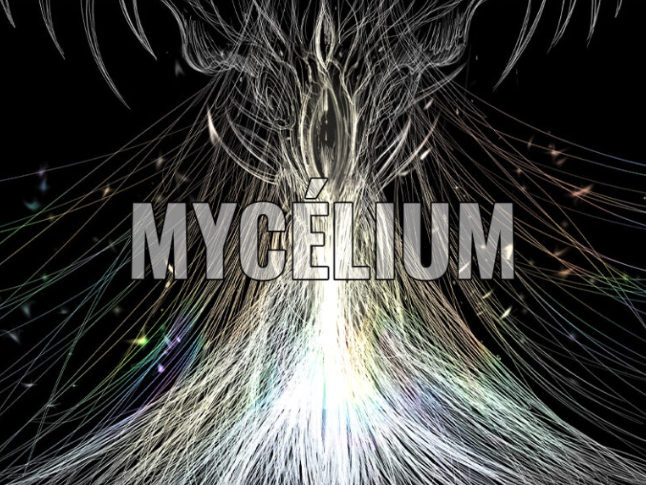

# Mycélium
 
## Echomarine 
ordre de préférence : 5
### Réalisé par:
- Florence Lapierre
- Natacha Abdallah
- Tracy Gua
- Maria Laura Coronel
### Lien avec Mycélium
- Thème de la nature
### Installation dans les studios
- Dans le petit studio, il y a une toile qui recouvre trois murs, des projecteurs au plafond et un ordinateur dans le coin de la pièce.
### Schéma d'installation prévue

### Cours nécéssaires
- Illustration numérique
- Animation 2D
- Web
### Expérience prévue
Je ne pense pas être très interpellé par Echomarine, le thème de l'océan n'est pas quelque chose qui me parle vraiment. Aprendre de l'information sur des animaux marins n'est pas quelque chose qui m'intéresse particulièrement.

## Edria
ordre de préférence : 2
### Réalisé par:
- Elwin Durand
- Loic Delorme
- Dominic Roberts
- Gabriel Leblanc
- Meryem Berbiche
- Jean-Christophe
### Lien avec Mycélium
- En plus d'un thème de la nature assez évident, pour experiencer cette oeuvre d'art à son plein potenciel, il faut le faire à plusieur. La comunication est une grande partie de "Edria", comme les champignons communiquent entre eux.
### Installation dans les studios
-Un seul pillier de métal qui fait du bruit lorsque les capteurs détectent quelqu'un de proche.
### Schéma d'installation prévue

### Cours nécéssaires
- Installation multimédia
- Interactivité ludique
- Objets interactifs
### Expérience prévue
L'oeuvre est intéressante, je vais probablement tester les limites de se que les capteurs peuvent détecter parce que en général, je suis plus intéressé par comment l'oeuvre marche que par l'oeuvre elle-même.

## LumaSol
### Réalisé par:
ordre de préférence : 4
- Éloïse Gagné
- Skayla Stimphil
- Michaël Simard
- Pénélope Morrisson
### Lien avec Mycélium
- Luma Sol consiste à plusieurs empoules toutes conecté ensemble, comme des champignons.
### Installation dans les studios
- Ue vélo stationaire est connecté à des empoules accrochées à un escalier.
### Schéma d'installation prévue

### Cours nécéssaires
- Objets interactifs
- Conception d’une expérience multimédia
- Installation multimédia
### Expérience prévue
Le vélo stationnaire qui active de la lumière peut être interessant pendant quelques minutes, mais j'ai l'impression que je m'ennuirai rapidement puisque c'est tout ce que l'oeuvre à a offrir.

## Nexum
ordre de préférence : 3
### Réalisé par:
- Sébastien Reilly
- Sabrina Laforest
- Alexandre Daniel
- Maxime Des Lauriers
### Lien avec Mycélium
- C'est une forêt magique simulée qui, de plus, contient des codes QR qui mènent à des vidéos contenant des champignons.
### Installation dans les studios
- Une table avec, dessus, un orinateur qui contient toutes les animations de l'oeuvre et un code QR sensé activer une des animations.
### Schéma d'installation prévue

### Cours nécéssaires
- Animation 2D
- Illustration numérique
- Web
### Expérience prévue
Je serai probablement très impressionné par les animations, elles sont bien faites et ça sonne amusant de tenter de toutes les trouver.

## Zodie-Gal
ordre de préférence : 1
### Réalisé par:
- Abdanor Yara
### Lien avec Mycélium
- Zodie-Gal a pour thème le combat entre humain et nature et, de plus, finir chaque niveau nécéssite de bien scanner son environement comme les champignons font lorsqu'ils communiquent entre eux.
### Installation dans les studios
- Simplement un ordi dan le coin du grand studio sur lequel on peut jouer à Zodie-Gal, l'installation sera pareille lors de l'exposition.
### Cours nécéssaires
-
-
-
### Expérience prévue
