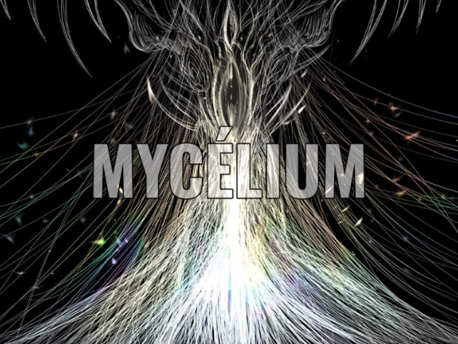
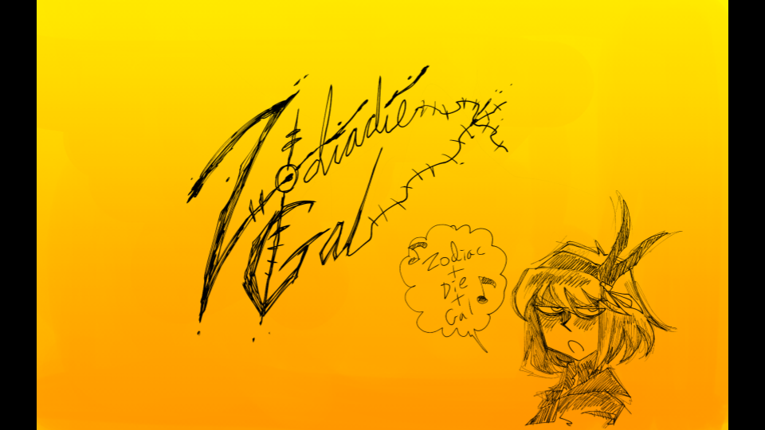
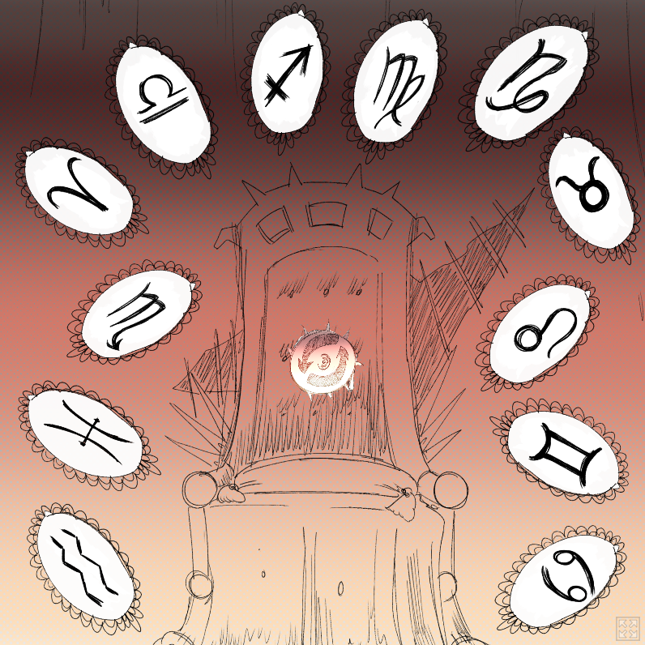
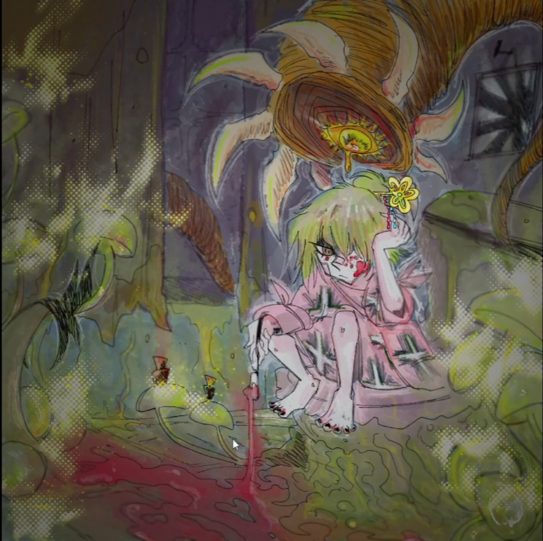

# Mycélium
une exposition temporaire  

## Collège Montmorency
J'ai visité cette exposition à plusieurs reprises du 20 au 23 mars
# Zodie-Gal
Une oeuvre interactive d'Abdanor Yara  

### Description et expérience vécue
Dans Zodie-Gal, on contrôle une jeune fille qui dois survivre un combat contre une suite de 12 monstres qui représentent chaqu'un un des signes du zodiac mais aussis les difficultées de la vie d'une jeune adolescente.  
  
Le but de chaque niveau  est de cliquer sur l'objet qui permettras au personnage principal de défaire la créature qui la met en danger.

Les niveaux ressemblent à ça : 
  
Par exemple : 

### Mise en espace
Dans le coin du grand studio, il y a un bureau illuminé d'une lampe, il y a un écran et une souris sur le bureau, c'est en utilisant ces derniers que l'on peut jouer à Zodie-Gal.  

Composantes : Le jeu en soi.

Techniques utilisées : Le logiciel GDevelop 5

Éléments nécéssaires à la mise en exposition : Un ordinateur, une souris, une enceinte et une lampe.

Ce qui m'a plu: Les dessins sont très beaux et les animations qui jouent à chaque fin de niveau sont très bien faits.

Ce qui m'a moins plu: l'histoire n'est pas assez claire à mon goût et les casse-têtes laissent un peu à désirer, certains sont trop façile, certains sont prèsque impossible à complèter, je n'aurai jamais fini le jeux si la créatrice du jeu ne se tenait pas à côté de moi pour me donner les réponces de temps en temps.

Références : [Page Zodie-gal](https://tim-montmorency.com/2023/projets/Zodie-Gal/docs/web/index.html)
