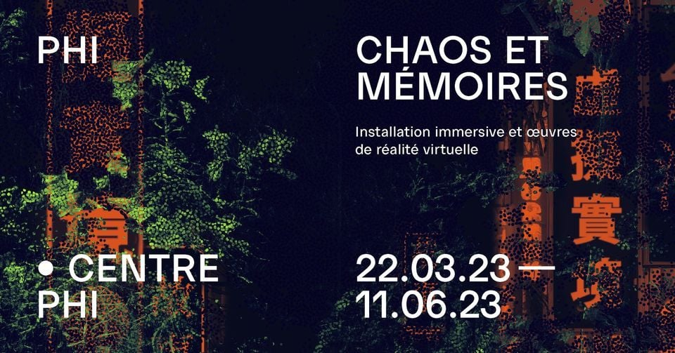
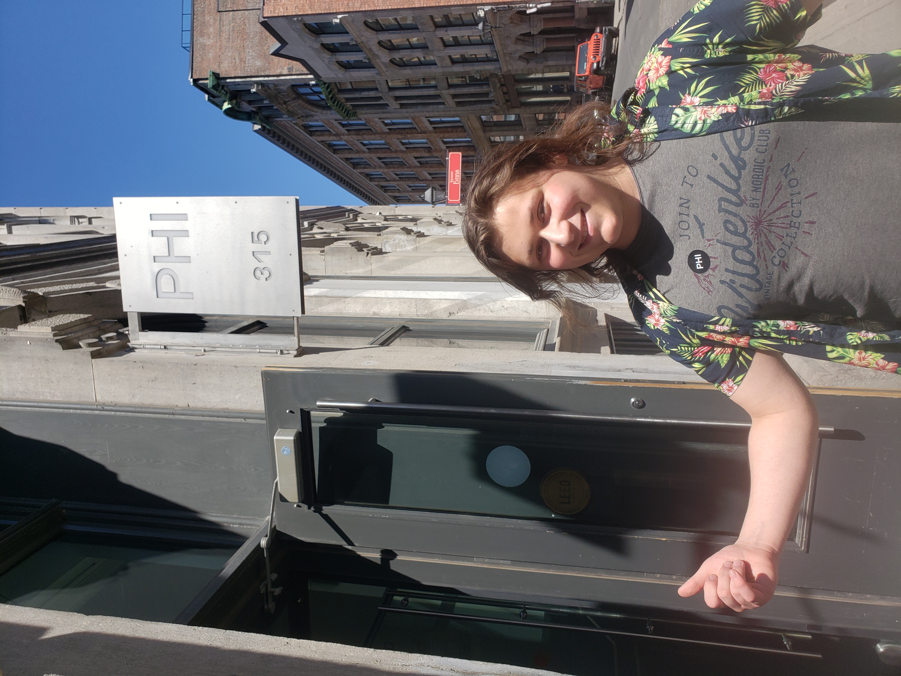
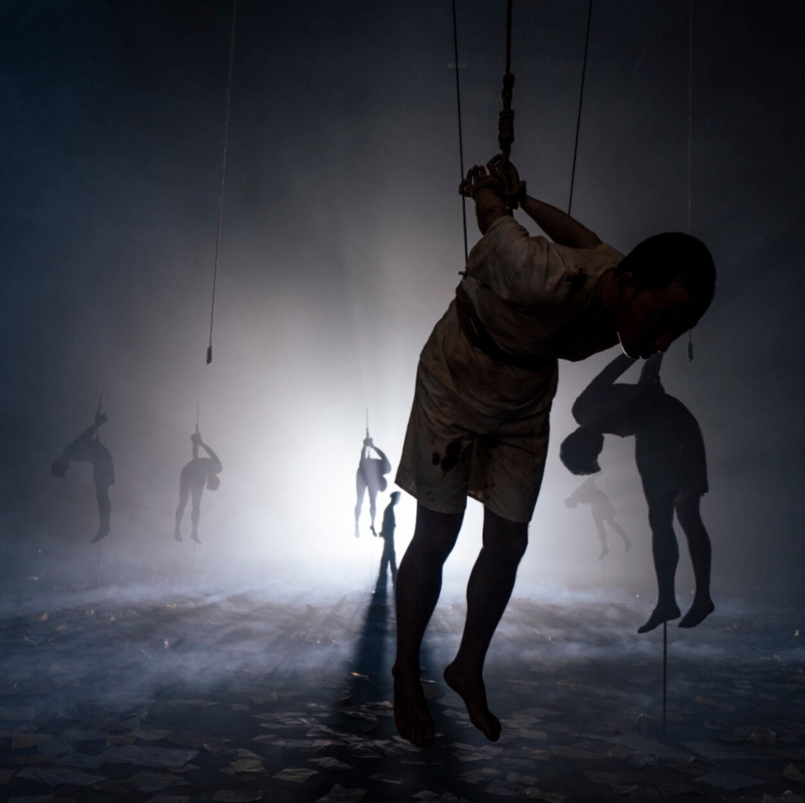
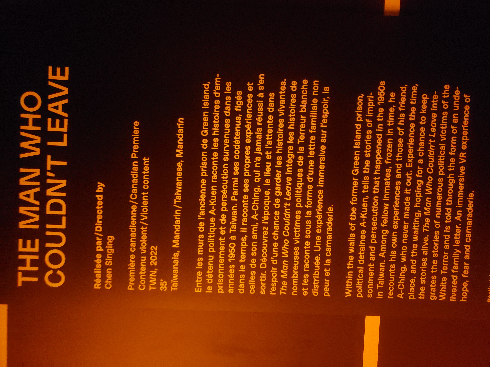
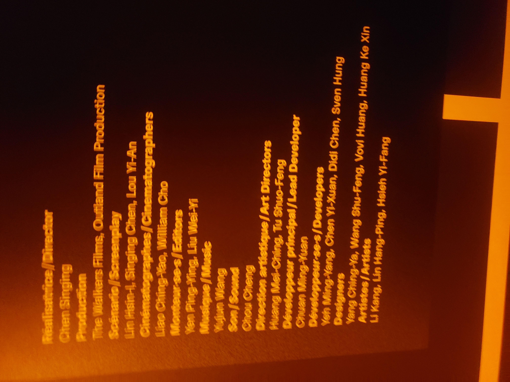
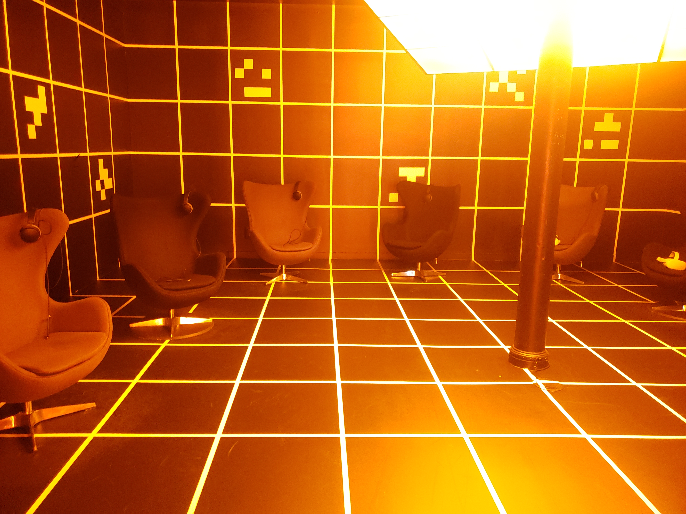

# Chaos et mémoires
Une exposition temporaire exterieure  

## Centre PHI
J'ai visité cette exposition le 16 avril 2023  

# The man who couldn't leave (2022)
Une oeuvre immersive de Chen Singing  

Après avoir mis le casque VR, l'audience se retrouve au millieu de l'océan alors qu'un voix explique en taïwanais, sous titré en anglais que dans les années 1950, entre les murs de l'ancienne prison taïwanaise de Green Island, des prisonniers politiques sont détenus dans d'affreuses condition par le gouvernement. Alors que nos alentours transitionnent à un dortoir remplis de pleins d'hommes figés dans le temps. La voix se révelle être un des prisonniers, un homme nommé A-Kuen, maintenant beaucoups plus agé (il n'avait que 19 ans quand il fût emprisonné) A-Kuen il décris ses expériences dans la prison et celles de son ami, A-Ching, qui, lui, n'est jamais sorti de Green Island.  
 

### Mise en espace
Dans la pièce, il y 6 chaises le long des murs qui ont chaqu'un un casque VR dessus, un visiteur n'a qu'a mettre le casque VR pour faire l'expérience de *The man who couldn't leave*.  

Composantes : Le fichier contenant l'oeuvre.

Éléments nécéssaires à la mise en exposition: Casques VR, des casques d'écoute et des chaises.

Ce qui m'a plu: L'histoire était captivante et le message est claire. À la fin de l'oeuvre, il y a une section où la caméra recule à ttravers des dépictions 3D de manifestants qui se battent avec des policiers pour leur liberté avec une chanson révolutionnaire en arrière-plan que j'ai trouvé très bien réalisée.

Ce qui m'a moins plu: La lumière me faisait mal aux yeux, je trouve que la couleure choisi était un peu trop dure sur les yeux surtout parce qu'elle faisait contraste avec l'utilisation de tons plus sombres de l'oeuvre.

Références : [Site du centre PHI](https://phi.ca/fr/evenements/chaos-et-memoires/)
