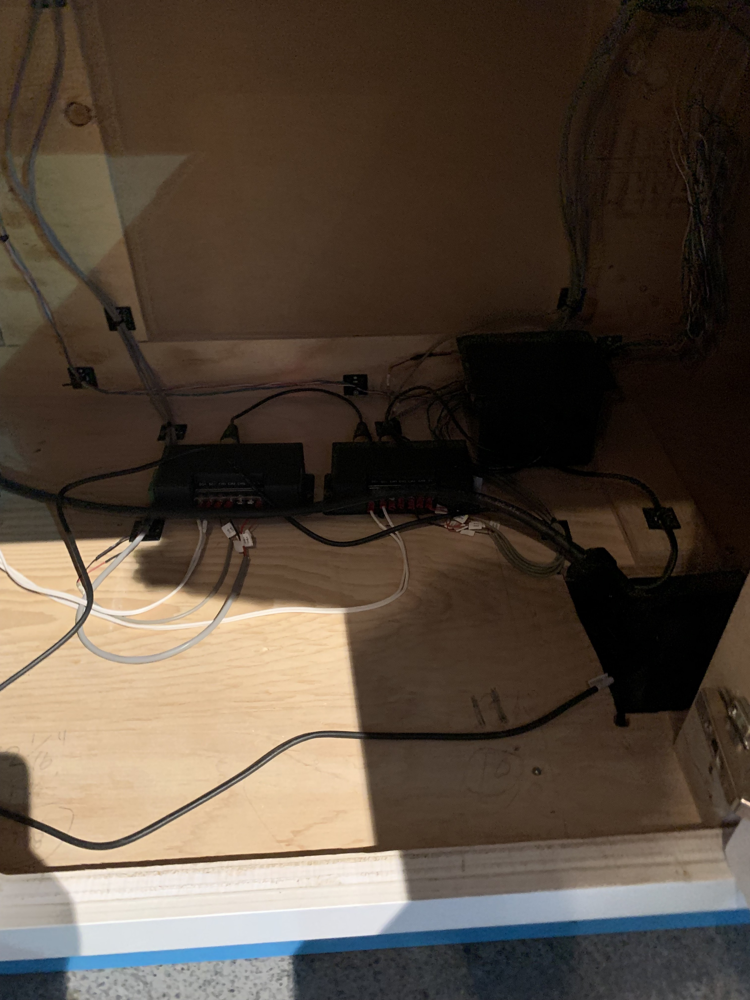

# Humain
une exposition permanente interieure 

## Centre des sciences
j'ai visité cette exposition le 12 avril 

# L'installation en question

Dans un trou rectangulaire à côté de l'installation en soi, il y a des plaques de bois sur lesquels sont des suites de lignes colorées et une silhouette d'animal. 

L'utilisateur à pour but d'aligner les lignes sur les plaques de bois avec celles qui sont sur l'oeuvre en soit.   
 
Ceci feras apparaître un fait sur l'animal de la plaque.

Composantes/Éléments nécéssaires à la mise en exposition : Des circuits, des fils, la programmation qui fait apparaitre l'information et les plaques de bois  
 
*Photo par : Maïk Hamel*

Ce qui m'a plu : Les faits divers qui apparaissent était intéressants et le fait de devoir aligner les lignes colorées ensembles est une bonne manière de garder l'attention des gens.

Ce qui m'a moins plu : Le bois utilisé pour faire les plaques semble de trop piètre qualitée pour une exposition pour tous les ages, j'ai l'impression qu'ils briserons façilement.

Références : [Site du Centre des sciences](https://www.centredessciencesdemontreal.com/exposition-permanente/humain)
