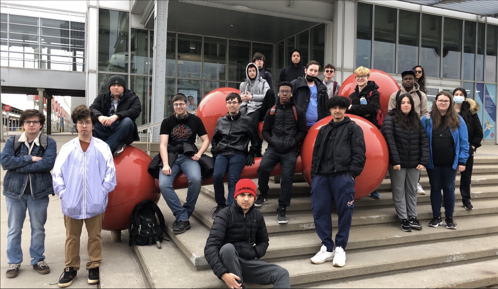

# Humain
une exposition permanente interieure 

## Centre des sciences
j'ai visité cette exposition le 12 avril 

# L'oeuvre en question

Dans un trou rectangulaire à côté de l'installation en soi, il y a des panneaux de bois sur lesquels sont des suites de lignes colorées et une silhouette d'animal. 

L'utilisateur à pour but d'aligner les lignes 

